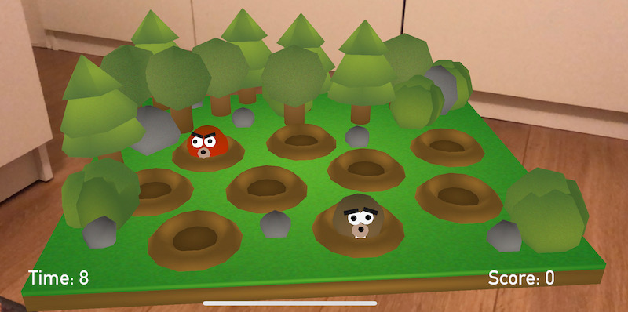

# WWDC 2019 

> This playground is an AR Whack-A-Mole game made with ARKit, SceneKit and SpriteKit. ARKit is used to create a more alive and intuitive experience. After detecting a plane to put the virtual playground on, game begins. 

